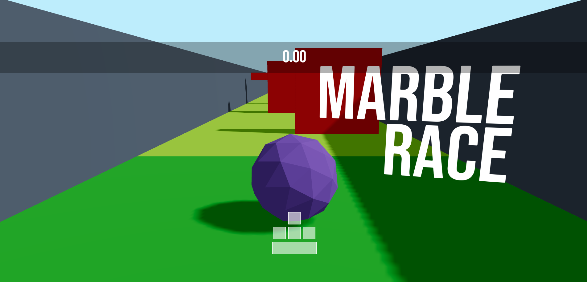
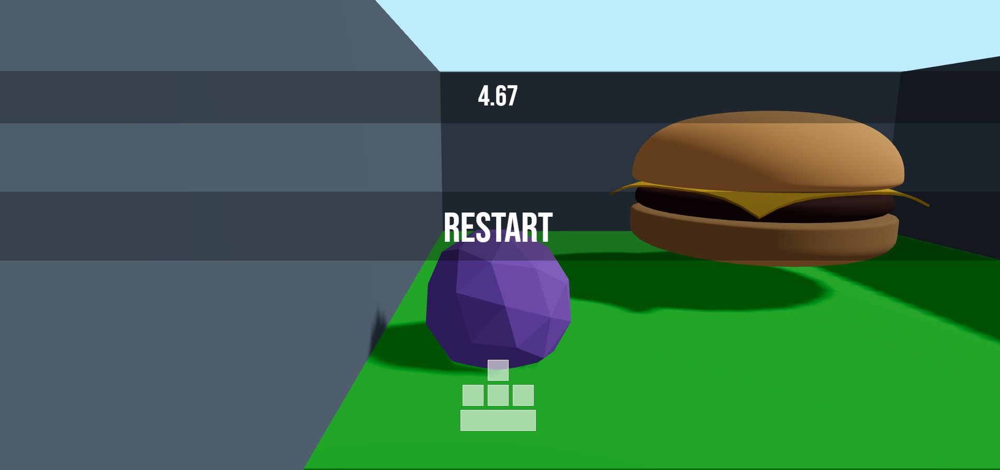

# Marble race

Simple Game is created using NextJS, React Three Fiber, Rapier and Zustand




## Getting Started

First, run the development server:

```bash
npm run dev
```

Open [http://localhost:3000](http://localhost:3000) with your browser to see the result.
